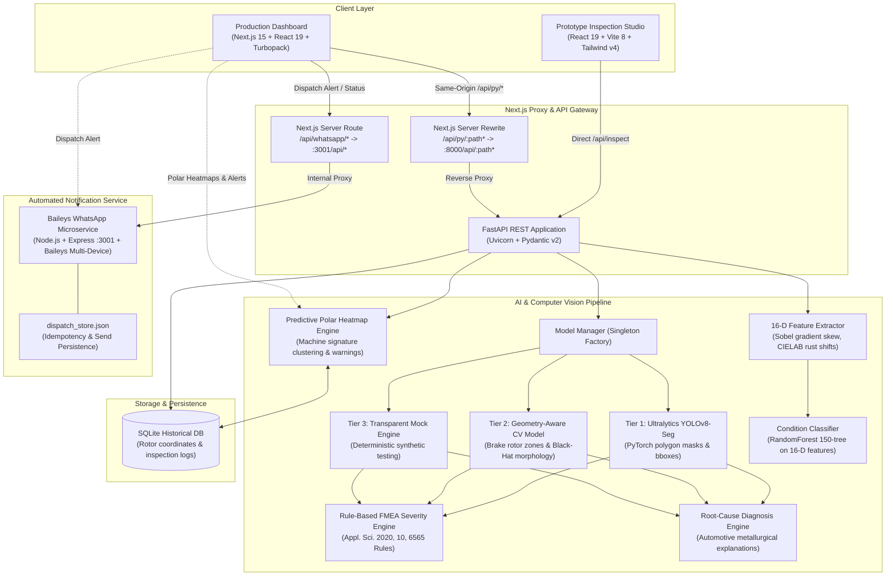
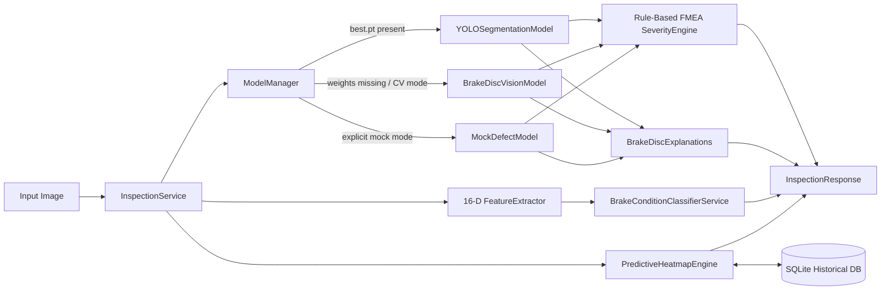

# AutoAudit

> **Automotive Quality Operations Dashboard, Multi-Tiered AI Defect Inspection & WhatsApp Maintenance Dispatch Platform**

AutoAudit is an industrial-grade manufacturing quality management platform engineered for precision automotive component production—specifically ventilated brake rotors, solid brake discs, machined shafts, and metallic castings.

The platform unites an **Executive Quality Operations Dashboard** (Next.js 15, React 19, Batch SPC quality trend analysis, circular rotor heatmaps, KPI scorecards, metrology tracking, and automated Baileys WhatsApp maintenance dispatch) with a **Multi-Tiered AI Defect Inspection Engine** (FastAPI, YOLOv8 polygon segmentation, 16-D physics-informed feature extraction, Random Forest condition triage, predictive machine-defect clustering, and rule-based FMEA risk evaluation based on published automotive research).

---

## 📑 Table of Contents

- [System Architecture](#-system-architecture)
- [Repository Map](#-repository-map)
- [Frontend Tech Stack](#-frontend-tech-stack)
  - [1. Production Operations Dashboard (`frontend/`)](#1-production-operations-dashboard-frontend)
  - [2. Prototype Inspection Workbench (`backend/frontend/`)](#2-prototype-inspection-workbench-backendfrontend)
- [Backend Tech Stack (`backend/backend/`)](#-backend-tech-stack-backendbackend)
- [Microservices: WhatsApp Dispatch Service (`services/whatsapp/`)](#-microservices-whatsapp-dispatch-service-serviceswhatsapp)
- [Computer Vision & AI Inference Pipeline](#-computer-vision--ai-inference-pipeline)
  - [Multi-Tiered Vision Models](#multi-tiered-vision-models)
  - [16-D Physics-Informed Feature Extractor](#16-d-physics-informed-feature-extractor)
  - [Calibrated Brake Rotor Condition Classifier](#calibrated-brake-rotor-condition-classifier)
  - [Research-Backed FMEA Severity Engine](#research-backed-fmea-severity-engine)
  - [Predictive Rotor Heatmap & Machine Signature Engine](#predictive-rotor-heatmap--machine-signature-engine)
  - [Engineering Root-Cause & Action Engine](#engineering-root-cause--action-engine)
- [Datasets & Training Pipelines](#-datasets--training-pipelines)
  - [Industrial Datasets & Benchmarks](#industrial-datasets--benchmarks)
  - [Data Preprocessing & Annotation Pipeline](#data-preprocessing--annotation-pipeline)
  - [Model Training Scripts](#model-training-scripts)
- [Academic Research & Industry Citations](#-academic-research--industry-citations)
- [API Reference](#-api-reference)
- [Local Development & Quick Start](#-local-development--quick-start)
  - [1. Start the FastAPI Backend](#1-start-the-fastapi-backend)
  - [2. Start the Production Next.js Dashboard](#2-start-the-production-nextjs-dashboard)
  - [3. Start the WhatsApp Maintenance Dispatch Service](#3-start-the-whatsapp-maintenance-dispatch-service)
  - [4. Run with Docker Compose](#4-run-with-docker-compose)
  - [5. Run Automated Backend Tests](#5-run-automated-backend-tests)
- [Cloud Deployment (AWS Amplify & ECS)](#-cloud-deployment-aws-amplify--ecs)
- [Configuration & Environment Variables](#-configuration--environment-variables)
- [Future Roadmap](#-future-roadmap)

---

## 🏗️ System Architecture



---

## 📂 Repository Map

```text
autoaudit/
├── frontend/                                # Production Next.js Dashboard
│   ├── app/
│   │   ├── api/
│   │   │   └── whatsapp/                    # Server-side dispatch proxy routes
│   │   │       ├── send-alert/route.ts      # Proxies dispatch POST to Baileys microservice
│   │   │       └── status/route.ts          # Checks WhatsApp Web pairing status
│   │   ├── globals.css                      # Industrial design system, SPC & heatmap styles (94KB)
│   │   ├── layout.tsx                       # Root layout & page metadata
│   │   └── page.tsx                         # 6-view operations & inspection portal with live polling
│   ├── components/
│   │   └── autoaudit/
│   │       ├── RotorHeatmap.tsx             # Circular polar heatmap (r, theta, clock-hour)
│   │       ├── Views.tsx                    # Studio, Dashboard, History, Batch, Faults, Review (47KB)
│   │       └── WhatsAppDispatch.tsx         # Baileys QR modal, alert review & wa.me fallback
│   ├── lib/
│   │   ├── api.ts                           # Typed API client, upload & health checks
│   │   ├── calculations.ts                  # Batch SPC trend analysis & CSV generator
│   │   ├── dispatch-log.ts                  # Client dispatch status log & persistence
│   │   ├── inspection-store.ts              # IndexedDB & LocalStorage persistence layer
│   │   ├── mechanical-knowledge.ts          # Engineering failure mechanisms knowledge base
│   │   ├── mock-data.ts                     # Seed inspection records & batch telemetry
│   │   └── types.ts                         # Complete TypeScript domain model & FMEA types
│   ├── next.config.ts                       # SSR configuration with /api/py rewrite proxy
│   ├── package.json                         # Next.js 15, React 19 dependencies
│   ├── tsconfig.json                        # TypeScript configuration
│   └── README.md                            # Frontend documentation
│
├── backend/                                 # Backend & AI Model Workspace
│   ├── backend/                             # FastAPI REST API & Vision Services
│   │   ├── app/
│   │   │   ├── api/
│   │   │   │   └── routes.py                # Endpoints: /health, /inspect, /analytics, /history, /sample
│   │   │   ├── inference/
│   │   │   │   ├── base_model.py            # Abstract BaseDefectModel interface
│   │   │   │   ├── cv_model.py              # Geometry-aware OpenCV brake disc defect analyzer
│   │   │   │   ├── mock_model.py            # Demo/mock fallback engine
│   │   │   │   ├── manager.py               # Singleton model factory & weight resolver
│   │   │   │   └── yolo_model.py            # Ultralytics YOLOv8/YOLO11 segmentation wrapper
│   │   │   ├── models/
│   │   │   │   ├── historical_schemas.py    # Polar coordinates, HeatmapBin, MachineSignatureWarning
│   │   │   │   └── schemas.py               # Pydantic schemas (FMEA, condition, severity, detections)
│   │   │   ├── services/
│   │   │   │   ├── brake_disc_explanations.py # Root-cause diagnosis & workshop repair guidance
│   │   │   │   ├── classifier_service.py    # 3-class Random Forest condition inference
│   │   │   │   ├── historical_db.py         # SQLite persistence for polar defect coordinates
│   │   │   │   ├── inspection_service.py    # Complete inspection pipeline orchestration
│   │   │   │   ├── predictive_engine.py     # Polar defect clustering & machine warnings (22KB)
│   │   │   │   └── severity_engine.py       # FMEA RPN engine (Appl. Sci. 2020, 10, 6565) (24KB)
│   │   │   ├── utils/
│   │   │   │   ├── feature_extractor.py     # 16-D physical and texture feature extraction
│   │   │   │   └── visualizer.py            # OpenCV mask, bounding box, and HUD overlay generator
│   │   │   ├── config.py                    # Pydantic Settings & environment variables
│   │   │   └── main.py                      # FastAPI entry point & CORS configuration
│   │   ├── samples/                         # Automotive test images & sample generator
│   │   ├── tests/                           # Pytest automated test suite
│   │   │   └── test_api.py                  # API unit & integration tests
│   │   ├── weights/                         # Pre-trained model weights
│   │   │   ├── best.pt                      # YOLOv8 segmentation model weights
│   │   │   └── brake_condition_classifier.joblib # Random Forest condition classifier weights
│   │   ├── Dockerfile                       # Python 3.11-slim backend container
│   │   ├── requirements.txt                 # Backend Python dependencies
│   │   └── .env.example                     # Environment template
│   │
│   ├── frontend/                            # Earlier Prototype Inspection Workbench
│   │   ├── src/                             # React 19 + Vite 8 + Tailwind CSS v4 prototype
│   │   ├── Dockerfile                       # Node build + Nginx alpine container
│   │   └── package.json                     # Prototype dependencies
│   │
│   ├── scripts/                             # Training, evaluation & dataset preparation
│   │   ├── download_dataset_guide.md        # Comprehensive dataset download & preparation guide
│   │   ├── prepare_thermal_dataset.py       # Binary mask to YOLO polygon segmentation converter
│   │   ├── train_brake_yolo.py              # YOLOv8/YOLO11 training script with automatic weight export
│   │   ├── train_condition_classifier.py    # Random Forest condition classifier trainer
│   │   └── train_fast_yolo.py               # Fast 5-epoch native resolution YOLO fine-tuner
│   │
│   └── docker-compose.yml                   # Local multi-container Docker stack
│
├── services/                                # Autonomous Microservices
│   └── whatsapp/                            # Baileys WhatsApp Dispatch Microservice
│       ├── auth_baileys/                    # Local multi-device WhatsApp credentials (git-ignored)
│       ├── dispatch_store.json              # Idempotent dispatch key tracking (git-ignored)
│       ├── package.json                     # Baileys, Express, Pino, QRCode dependencies
│       ├── README.md                        # WhatsApp service documentation & security guide
│       ├── server.js                        # Express server listening on 127.0.0.1:3001
│       └── .env.example                     # WhatsApp token & phone configuration template
│
├── infra/                                   # Cloud Infrastructure & Deployment
│   └── aws/
│       └── README.md                        # AWS Amplify & ECS deployment guide
│
├── amplify.yml                              # AWS Amplify Hosting monorepo build configuration
└── README.md                                # Root repository guide (this file)
```

---

## 💻 Frontend Tech Stack

The platform features a production Next.js dashboard as well as an earlier prototype workbench:

### 1. Production Operations Dashboard (`frontend/`)

A manufacturing operations portal tailored for automotive plant managers, quality directors, and workshop inspection engineers.

| Technology | Version | Purpose |
| :--- | :--- | :--- |
| **Next.js** | `^15.5.0` | React framework with App Router, Server-Side Rendering (SSR), and Turbopack |
| **React** | `^19.1.0` | Declarative UI rendering engine |
| **TypeScript** | `^5.0.0` | Strict static typing across domain models and API contracts |
| **Turbopack** | Built-in | Next-generation ultra-fast bundler (`next dev --turbopack`) |
| **ESLint** | `^9.0.0` | Code quality and standard linting with Flat Config |
| **Custom Industrial CSS** | Pure CSS (`globals.css`) | 94KB specialized dark-mode styling system with tabular layout, responsive grid, radial glow heatmaps, and SVG sparklines |
| **Storage Engine** | IndexedDB + LocalStorage | Client-side inspection history persistence in `lib/inspection-store.ts` |

#### The 6 Core Views (`components/autoaudit/Views.tsx`):
1. **AI Inspection Studio:**
   - Real-time image upload (drag-and-drop or file selector) triggering `/api/py/inspect`.
   - Side-by-side original vs. annotated view with color-coded bounding boxes, polygon masks, confidence badges, and rotor zone tags.
   - Live **FMEA Risk Priority Card** displaying Process Code (e.g. `CR01`, `DT17`, `BA02`), Severity $S$, Occurrence $O$, Detection $D$, and calculated $RPN$.
   - **Triage Condition Pill** (`GOOD`, `ALMOST_WORN`, `FAULTY`) and **Wear Index Score** ($0\text{–}100$).
   - Engineering root-cause failure explanation and actionable workshop recommendations.
2. **Main Dashboard:**
   - **Batch SPC Quality Trend:** Real-time line graph plotting defect rates against upper control limits (UCL).
   - **High-Impact KPI Scorecards:** First-Pass Yield (98.6% vs 98.0% target), total parts inspected, review count, and line availability.
   - **Live Telemetry & Station Availability:** Real-time station status across High-Speed (Line 01), Standard (Line 02), and Precision Lab (Line 03) cells.
   - **Metrology Tolerances:** ISO checks for Disc Thickness Variation (DTV $\le 5\ \mu\text{m}$), Lateral Runout ($\le 25\ \mu\text{m}$), and Surface Roughness ($Ra$).
3. **Inspection History:**
   - Filterable, searchable historical record of inspected components with Part ID, Serial, Timestamp, Line, and Disposition badges (`PASS`, `REVIEW`, `REJECT`).
4. **Batch Data:**
   - Manufacturing lot performance tracking, batch defect rates, and machine ID correlation.
5. **Fault Intelligence Board:**
   - **Circular Rotor Heatmap (`RotorHeatmap.tsx`):** Renders polar defect distribution ($r, \theta$, clock-hour) with radial glow on the circular disc, identifying spatial defect concentrations.
   - **Active Early Warnings Card:** Dynamically displays machine signature alerts (e.g. *Grinding Station CBN Wheel Wear*, *Robot Gripper Buffer Pad Degradation*).
   - Pareto defect distributions and failure physics from `mechanical-knowledge.ts`.
6. **Human Review:**
   - Quality engineer disposition override workflow, defect re-classification, reviewer notes, and audit-trail logging.
7. **WhatsApp Maintenance Dispatch Modal (`WhatsAppDispatch.tsx`):**
   - QR code pairing for WhatsApp Web multi-device session.
   - Automatic dispatch of high-severity alerts (`CRITICAL` / $RPN > 100$) to maintenance station leads.
   - Manager-approved manual dispatch with `wa.me` fallback link.

---

### 2. Prototype Inspection Workbench (`backend/frontend/`)

An earlier standalone prototype created with **Vite 8.3**, **React 19.2**, **Tailwind CSS v4.3**, **Lucide React**, and **Oxlint**. It provides an isolated visual workbench for quick model testing and local validation.

---

## ⚙️ Backend Tech Stack (`backend/backend/`)

A high-performance asynchronous Python REST microservice designed for low-latency visual inference, rule-based FMEA evaluation, polar spatial clustering, and automated image processing.

| Technology | Version | Purpose |
| :--- | :--- | :--- |
| **FastAPI** | `>=0.110.0` | Asynchronous REST framework with automatic OpenAPI/Swagger documentation |
| **Uvicorn** | `>=0.28.0` | Production ASGI web server |
| **Pydantic & Settings** | `>=2.6.0` / `>=2.2.0` | Strict request/response validation and environment-based configuration |
| **OpenCV Headless** | `>=4.9.0.80` | Image reading, spatial filtering, Black-Hat morphology, Canny edges, mask rendering |
| **Pillow** | `>=10.0.0` | Image ingestion validation, format conversion, and integrity checking |
| **NumPy** | `>=1.26.0` | Matrix operations, vectorized pixel calculations, coordinate normalization |
| **Scikit-Learn** | `>=1.3.0` | Random Forest classifier for condition triage |
| **Joblib** | `>=1.3.0` | Binary serialization of trained Scikit-learn models |
| **Ultralytics & PyTorch** | `>=8.1.0` / `>=2.2.0` | YOLOv8/YOLO11 deep learning segmentation inference and training |
| **SQLite3** | Standard Library | Embedded historical database (`historical_db.py`) for defect polar coordinates and shift logs |
| **Pytest & HTTPX** | `>=8.0.0` / `>=0.27.0` | Automated test suite and asynchronous HTTP client |
| **Docker** | Multi-stage | Containerization based on `python:3.11-slim` with system libraries (`libgl1`, `libglib2.0`) |

---

## 📱 Microservices: WhatsApp Dispatch Service (`services/whatsapp/`)

An autonomous Node.js service providing instant messaging alerts to station maintenance leads when high-risk anomalies occur:

| Technology | Version | Purpose |
| :--- | :--- | :--- |
| **Node.js & Express** | `^4.19.2` | Local microservice HTTP server listening on `127.0.0.1:3001` |
| **@whiskeysockets/baileys**| `^6.7.8` | Production-grade WhatsApp Web Multi-Device socket connection |
| **QRCode** | `^1.5.3` | QR-code string and data URL generation for pairing via phone |
| **Pino** | `^9.0.0` | High-speed structured JSON logging |

#### Security & Idempotency Features:
- **Loopback Binding:** Listens strictly on `127.0.0.1:3001`; Next.js server routes proxy calls to it, keeping tokens hidden from browser clients.
- **Persistent Dispatch Store (`dispatch_store.json`):** Tracks sent alerts using composite idempotency keys (`partId:processCode:timestamp`) to guarantee zero duplicate sends across analytics refreshes or service restarts.
- **Graceful Fallback:** If the WhatsApp socket is disconnected, the frontend UI automatically falls back to an encoded `wa.me` manual review link.

---

## 🧠 Computer Vision & AI Inference Pipeline

AutoAudit uses a multi-layered, resilient inference architecture that combines deep learning segmentation, classical mathematical morphology, domain-informed physics, and spatial clustering:



### Multi-Tiered Vision Models

#### 1. Real AI YOLO Segmentation (`YOLOSegmentationModel`)
- **Weights:** [`backend/backend/weights/best.pt`](file:///E:/Downloads/autoaudit/backend/backend/weights/best.pt)
- **Model:** Ultralytics YOLOv8 nano segmentation (`yolov8n-seg.pt`) fine-tuned for automotive component defect contours.
- **Output:** Sub-millimeter polygon contours (`mask_polygon`) and bounding boxes (`bbox`).
- **Unknown Anomaly Safety Floor:** If an anomaly is segmented with confidence $\ge 0.35$ but classification certainty falls below $0.55$, it is automatically flagged as an **Unknown Anomaly** to eliminate high-risk misclassifications.

#### 2. Geometry-Aware Computer Vision Model (`BrakeDiscVisionModel`)
- Engineered in [`cv_model.py`](file:///E:/Downloads/autoaudit/backend/backend/app/inference/cv_model.py) for environments without GPU acceleration.
- Mathematically partitions the brake disc into 4 functional zones:
  1. *Outer Friction Ring (Swept Area)*
  2. *Center Hub Hat*
  3. *Outer Cooling Edge*
  4. *Cooling Vane Channel*
- Uses **Black-Hat morphological filtering** ($T_{B}(I) = \text{close}(I) - I$) with rectangular structuring elements to isolate narrow, dark fracture fissures while filtering out circular lathe lines.
- Evaluates $L^*a^*b^*$ color space to isolate oxidation rust scale independently of lighting intensity.

#### 3. Demo / Mock Model (`MockDefectModel`)
- Transparent fallback when weights are missing. Clearly labeled as `demo_mock` in the API and UI. Never fakes deep learning.

---

### 16-D Physics-Informed Feature Extractor

Located in [`app/utils/feature_extractor.py`](file:///E:/Downloads/autoaudit/backend/backend/app/utils/feature_extractor.py), this module extracts 16 domain-specific features from the component surface:
1. **Surface Roughness & Contrast:** Mean gray intensity ($\mu_{gray}$), standard deviation ($\sigma_{gray}$), and 95th-to-5th percentile contrast.
2. **Edge Density:** Canny edge density ($T_1=50, T_2=150$) masked exclusively across active rotor metal.
3. **Directional Gradient Skew (Sobel Operators):**
   $$\nabla I_x = \text{Sobel}_x(I),\quad \nabla I_y = \text{Sobel}_y(I),\quad |\nabla I| = \sqrt{\nabla I_x^2 + \nabla I_y^2}$$
   Compares horizontal vs. vertical gradient variance to distinguish normal concentric lathe lines (circular) from transverse fracture cracks (radial/perpendicular).
4. **Micro-Fracture Crevice Energy:** Morphological Black-Hat crevice intensity and peak threshold energy:
   $$E_{crack} = \frac{1}{|M_{disc}|} \sum_{(x,y) \in M_{disc}} \mathbb{I}[(\text{close}(I) - I)(x,y) > 35]$$
5. **CIELAB Chromatic Rust Shifts:** Standard deviation in $a^*$ (redness) and $b^*$ (yellowness) channels, detecting oxidation scale.
6. **Annular Radial Variance:** Distance-weighted variance relative to rotor geometric center coordinates.

---

### Calibrated Brake Rotor Condition Classifier

Located in [`app/services/classifier_service.py`](file:///E:/Downloads/autoaudit/backend/backend/app/services/classifier_service.py), this service runs a 150-tree Random Forest classifier (`brake_condition_classifier.joblib`) on the 16-D feature vector:
- **`GOOD`**: Factory clean surface, uniform concentric lathe microgrooves, absence of fractures, Wear Index $< 25$.
- **`ALMOST_WORN`**: Swept track circumferential scoring, minor edge oxidation, Wear Index between $30$ and $65$.
- **`FAULTY`**: Jagged thermal fractures, radial edge cracks, cementite hot spots, Wear Index $> 70$.
- Outputs a continuous **Wear & Damage Index Score** ($0.0\text{ to }100.0$) and class probability distribution.

---

### Research-Backed FMEA Severity Engine

Located in [`app/services/severity_engine.py`](file:///E:/Downloads/autoaudit/backend/backend/app/services/severity_engine.py), the severity engine implements published automotive quality research:

> **Research Citation:**  
> Febriani, R.A.; Park, H.-S.; Lee, C.-M.  
> *"A Rule-Based System for Quality Control in Brake Disc Production Lines"*  
> **Applied Sciences 2020**, 10, 6565; [doi:10.3390/app10186565](https://doi.org/10.3390/app10186565).

The engine computes the **Risk Priority Number (RPN)**:
$$\text{RPN} = \text{Severity (S)} \times \text{Occurrence (O)} \times \text{Detection (D)}$$

| Process Code | Station | Failure Mode | Severity ($S$) | Occurrence ($O$) | Detection ($D$) | RPN | RPN Tier | Recommended Corrective Action |
| :--- | :--- | :--- | :---: | :---: | :---: | :---: | :--- | :--- |
| **CR01** | Inspection Station | Thermal crack / radial fracture | **10** | 3 | 4 | **120** | **Top 1–5 (Critical)** | Condemn rotor immediately; check brake pad thermal load |
| **BA02** | Balancing Station | Lateral runout / hat warpage | **8** | 2 | 7 | **112** | **Top 1–5 (Critical)** | Check hub runout ($< 0.05\text{ mm}$); verify clamp torque |
| **DT17** | Grinding Station | Disc Thickness Variation (DTV) | **8** | 3 | 4 | **96** | **Top 6–10 (High)** | Dress CBN grinding wheel; calibrate double-disc gap |
| **DT15** | Grinding Station | Deep scoring / circumferential grooves | **7** | 3 | 4 | **84** | **Top 6–10 (High)** | Inspect coolant filtration ratio; check lathe tool chatter |
| **PU01** | Picking-up Station | Robot unloader gripper indentation | **6** | 3 | 4 | **72** | **Top 6–10 (High)** | Realign robot gripper fingers; replace polyurethane pads |
| **DT16** | Grinding Station | Uneven wear of CBN grinding wheel | **6** | 3 | 4 | **72** | **Top 6–10 (High)** | Execute wheel dressing cycle; check tool replacement counter |
| **IN01** | Inspection Station | Oxidation rust scale | **5** | 5 | 2 | **50** | **Top 11–15 (Medium)** | Resurface on lathe if within tolerance; check packaging |

#### Multi-Sensor Fusion Note:
Optical vision detects 2D surface anomalies (cracks, scoring, cavities, rust); contact displacement probes at final gauge stations measure 3D parameters (DTV limit $\le 5\ \mu\text{m}$, Runout limit $\le 25\ \mu\text{m}$, Parallelism limit $\le 40\ \mu\text{m}$) per Section 3 of the paper.

---

### Predictive Rotor Heatmap & Machine Signature Engine

Located in [`app/services/predictive_engine.py`](file:///E:/Downloads/autoaudit/backend/backend/app/services/predictive_engine.py), this module models spatial defect distribution on circular brake rotors:
1. **Polar Transformation:** Bounding box center coordinates are mapped into normalized polar coordinates relative to the hub center:
   - $r \in [0.0, 0.5]$ (radial distance from center to outer rim)
   - $\theta \in [0^\circ, 360^\circ)$ (clock angle, where $0^\circ$ is 12 o'clock)
   - Clock-Hour position (e.g. 1.5 = 1:30 position)
2. **Machine Signature Pattern Matching:**
   - **Bipolar Clamping Signature (`PU01`):** High defect frequency clustered at $\theta \approx 90^\circ$ and $270^\circ$ indicates misaligned robot unloader gripper fingers.
   - **Annular Track Scoring Signature (`DT16`):** Concentric grooves at $0.31 \le r \le 0.37$ across multiple angles indicates dull CBN grinding wheels.
   - **Transverse Radial Fracture Signature (`CR01`):** High crevice energy crossing $0.30 \le r \le 0.42$ flags induction quenching thermal shock.
3. **Active Early Warnings:** Automatically triggers `MachineSignatureWarning` events and feeds them to the Fault Intelligence Board and WhatsApp dispatch service when statistically significant clusters occur.

---

### Engineering Root-Cause & Action Engine

Located in [`app/services/brake_disc_explanations.py`](file:///E:/Downloads/autoaudit/backend/backend/app/services/brake_disc_explanations.py), the engine translates vision detections into mechanical failure explanations and workshop actions:
- **Thermal Crack:** Cyclic thermal shock micro-cracking. *Action:* Immediate replacement required; do not resurface on lathe.
- **Radial Fracture:** Structural fracture extending to cooling edge. *Action:* Condemn rotor immediately; replace axle pair.
- **Deep Scoring:** Metal-on-metal pad backing plate contact or abrasive debris. *Action:* Measure thickness against minimum discard specification (Min TH); skim on lathe if within spec.
- **Cementite Hot Spot:** Localized temperatures $> 650^\circ\text{C}$ causing transformation to brittle cementite. *Action:* Replace rotor pair (resurfacing will not cure subsurface cementite).
- **Surface Contamination:** Hydrocarbon lubricant or brake fluid on swept surface. *Action:* Clean with residue-free brake cleaner; replace oil-soaked brake pads immediately.

---

## 📊 Datasets & Training Pipelines

### Industrial Datasets & Benchmarks

| Dataset Name | Source / Official Benchmark Link | Description & Relevance | Defect Classes |
| :--- | :--- | :--- | :--- |
| **Thermal Brake Disc Fissures** | [Mendeley Data (gbffch5dmv/1)](https://data.mendeley.com/datasets/gbffch5dmv/1) | High-resolution real automotive & railway brake rotor images with binary fissure masks (Bieberach, 2026; DOI: [10.17632/gbffch5dmv.1](https://doi.org/10.17632/gbffch5dmv.1)). Preprocessed by `prepare_thermal_dataset.py`. | Penetrating, incipient, and superficial thermal cracks |
| **Car Brake Disc Defect Benchmark** | [IEEE Access 2024 (10528319)](https://ieeexplore.ieee.org/document/10528319) | Automotive brake disc surface defect detection benchmark (Guo et al., 2024; DOI: [10.1109/ACCESS.2024.3399547](https://doi.org/10.1109/ACCESS.2024.3399547)). **Primary Core Reference.** | Surface cracks, holes, scratches, edge chips |
| **GC10-DET Metallic Surface Defects** | [Hugging Face](https://huggingface.co/datasets/dronefreak/GC10-DET) / [DatasetNinja](https://datasetninja.com/gc10-det#download) | Industrial standard dataset for metallic and cast sheet defects. Standardizes surface vs thermal flaw taxonomy. | Inclusions, rolled pits, oil spots, water spots, creases, punching holes, crescent gaps |
| **Kolektor Surface-Defect Dataset (KolektorSDD)** | [ViCoS Lab KolektorSDD](https://www2.vicos.si/resources/kolektorsdd/) | High-precision microscopic crack and fracture segmentation on machined electrical commutators and metal surfaces (Tabernik et al.). | Micro-fissures, microscopic cracks, surface fractures |
| **Applied Sciences 2020 FMEA Dataset** | [MDPI Appl. Sci. 2020, 10, 6565](https://www.mdpi.com/2076-3417/10/18/6565) | 16 top failure modes and corrective maintenance actions across brake disc production lines (Febriani, Park, Lee). | DTV, Runout, Parallelism, Surface Roughness |
| **Powertech Auto Technical Knowledge Base** | [Powertech Auto Report](https://www.powertech-auto.com/why-do-brake-discs-crack/) | Metallurgical failure modes for thermal cracks, cementite phase transformation, pad scoring, and minimum discard limits. | Thermal cracks, cementite transformation, pad scoring |
| **MAT Foundry Engineering Standards** | [MAT Foundry Brake Disc Guide](https://www.matfoundrygroup.com/products/the-ultimate-guide-to-automotive-brake-discs) | Metallurgical standards for grey cast iron (HT250, HT200), thermal checking, disc ventilation, and DTV limits. | Heat checking, disc thickness variation, lateral runout |

---

### Data Preprocessing & Annotation Pipeline

#### `backend/scripts/prepare_thermal_dataset.py`
Converts raw binary ground-truth segmentation masks into standardized YOLO polygon format:
1. Loads matched image and mask pairs from the dataset.
2. Extracts external contours using OpenCV (`cv2.findContours`).
3. Simplifies contour vertices using the **Ramer-Douglas-Peucker algorithm** (`cv2.approxPolyDP`) with an adaptive epsilon ($\epsilon = 0.005 \times \text{perimeter}$) to compress label size by 85% while preserving fracture geometry.
4. Normalizes vertex coordinates to $[0.0, 1.0]$.
5. Generates an 80/20 train/validation split with directory structure and a ready-to-train `data.yaml` file:
   ```yaml
   path: /path/to/dataset_thermal_brake
   train: images/train
   val: images/val
   names:
     0: thermal_crack
   ```

---

### Model Training Scripts

All training scripts are located in `backend/scripts/`:

#### 1. Train YOLOv8-Seg on Brake Defect Datasets
```bash
python backend/scripts/train_brake_yolo.py \
  --data dataset_thermal_brake/data.yaml \
  --epochs 50 \
  --batch 16 \
  --model yolov8n-seg.pt
```
- Trains YOLOv8 segmentation on GPU (or CPU fallback).
- Automatically saves and copies the best model weights directly to `backend/backend/weights/best.pt`.

#### 2. Fast Fine-Tuning Script
```bash
python backend/scripts/train_fast_yolo.py
```
- Pre-configured 5-epoch training run matched to the native $256 \times 256$ resolution of the thermal fissure dataset.

#### 3. Train Condition Classifier
```bash
python backend/scripts/train_condition_classifier.py
```
- Generates balanced training samples across `GOOD`, `ALMOST_WORN`, and `FAULTY` states.
- Extracts 16-D physical features and fits a 150-tree `RandomForestClassifier`.
- Exports calibrated weights to `backend/backend/weights/brake_condition_classifier.joblib`.

---

## 📚 Academic Research & Industry Citations

AutoAudit’s computer vision architecture, failure mode analysis, mechanical explanations, and production line tolerances are grounded in published peer-reviewed research and industrial technical reports:

### ⭐ 1. Primary Core Reference: IEEE Access (2024) — Car Brake Disc Surface Defect Detection Based on Improved YOLOv5
> **Citation:** Guo, Y., Zhang, X., & Dong, Z. (2024). *Car Brake Disc Surface Defect Detection Based on Improved YOLOv5*. **IEEE Access**, vol. 12, pp. 68601–68610, May 2024.  
> **DOI & URL:** [https://doi.org/10.1109/ACCESS.2024.3399547](https://doi.org/10.1109/ACCESS.2024.3399547) | [IEEE Xplore (Document 10528319)](https://ieeexplore.ieee.org/document/10528319) | [Direct PDF Stamp](https://ieeexplore.ieee.org/stamp/stamp.jsp?tp=&arnumber=10528319)

- **Why This is Our Primary Reference:**
  - Establishes the foundational **Computer Vision & Deep Learning Architecture** for automotive brake rotor inspection implemented in [`backend/backend/app/inference/yolo_model.py`](backend/backend/app/inference/yolo_model.py) and [`backend/scripts/train_brake_yolo.py`](backend/scripts/train_brake_yolo.py).
  - Demonstrates that automated visual inspection resolves the high missed detection rate of manual human visual inspection caused by inspector fatigue during high-volume production.
  - Validates sub-millimeter defect detection, achieving an average accuracy rate $> 90.5\%$, a low missed detection rate ($1.38\%$), and a false detection rate reduced to $1.5\%$.
  - Informs our lightweight YOLO segmentation pipeline for real-time edge execution on factory floor IPCs and NVIDIA Jetson hardware at low latency.

---

### 2. MDPI Applied Sciences (2020) — Rule-Based FMEA Quality Control in Brake Disc Production Lines
> **Citation:** Febriani, R. A., Park, H.-S., & Lee, C.-M. (2020). *A Rule-Based System for Quality Control in Brake Disc Production Lines*. **Applied Sciences**, 10(18), 6565.  
> **DOI & URL:** [https://doi.org/10.3390/app10186565](https://doi.org/10.3390/app10186565) | [MDPI Open Access](https://www.mdpi.com/2076-3417/10/18/6565)

- **Direct Application in AutoAudit:**
  - Powers our **24KB Rule-Based FMEA Severity Engine** in [`backend/backend/app/services/severity_engine.py`](backend/backend/app/services/severity_engine.py) and Pydantic schema in [`backend/backend/app/models/schemas.py`](backend/backend/app/models/schemas.py).
  - Implements the FMEA decision table across 4 production line stations (*Grinding Station*, *Balancing Station*, *Picking-up Station*, *Inspection Station*).
  - Calculates the Risk Priority Number: $\text{RPN} = \text{Severity (S)} \times \text{Occurrence (O)} \times \text{Detection (D)}$.
  - Maps real manufacturing process codes: `CR01` (Crack/Fissure, $S=10, RPN=120$), `BA02` (Dynamic Runout, $S=8, RPN=112$), `DT17` (DTV, $S=8, RPN=96$), `DT15` (Scoring/Grooves, $S=7, RPN=84$), `PU01` (Robot Unloader Gripper, $S=6, RPN=72$), `DT16` (CBN Wheel Wear, $S=6, RPN=72$), `IN01` (Rust Scale, $S=5, RPN=50$).
  - Incorporates multi-sensor tolerance limits: Disc Thickness Variation ($\text{DTV} \le 5\ \mu\text{m}$ across $>12$ contact points), Lateral Runout ($\le 25\ \mu\text{m}$ at $5\text{ mm}$ from outer edge), and Parallelism ($\le 40\ \mu\text{m}$ across $8$ points).

---

### 3. Mendeley Data (2026) — Thermal Brake Disc Fissures Dataset
> **Dataset:** Bieberach, Natalia (2026). *Thermal Brake Disc Fissures*. **Mendeley Data**, V1.  
> **DOI & URL:** [https://doi.org/10.17632/gbffch5dmv.1](https://doi.org/10.17632/gbffch5dmv.1) | [Mendeley Data Repository (gbffch5dmv/1)](https://data.mendeley.com/datasets/gbffch5dmv/1)

- **Direct Application in AutoAudit:**
  - The ground-truth dataset utilized by our dataset converter [`backend/scripts/prepare_thermal_dataset.py`](backend/scripts/prepare_thermal_dataset.py) to train YOLO segmentation on real thermal brake fissures.
  - Contains thermal infrared captures of cracked brake discs and annotated ground-truth masks for **Penetrating**, **Incipient**, and **Superficial** micro-fissures.

---

### 4. ViCoS Lab — Kolektor Surface-Defect Dataset (KolektorSDD)
> **Dataset & Research:** Tabernik, D., Šuc, S., & Skočaj, D. (2020). *Automated surface anomaly detection with visually explained deep learning*. **Computers in Industry**, 114, 103139.  
> **URLs:** [ViCoS KolektorSDD Portal](https://www2.vicos.si/resources/kolektorsdd/) | [ViCoS Research Lab](https://www.vicos.si/)

- **Direct Application in AutoAudit:**
  - Benchmark dataset for microscopic crack, fracture, and fissure detection on precision machined metal surfaces.
  - Validates our morphology-based crevice isolation ($T_B(I)$ Black-Hat transform in `feature_extractor.py`) and sub-millimeter fissure segmentation.

---

### 5. GC10-DET — Metallic Surface Defect Dataset (Hugging Face & DatasetNinja)
> **Dataset:** GC10-DET Metallic Surface Defect Dataset.  
> **URLs:** [Hugging Face (`dronefreak/GC10-DET`)](https://huggingface.co/datasets/dronefreak/GC10-DET) | [DatasetNinja GC10-DET](https://datasetninja.com/gc10-det#download)

- **Direct Application in AutoAudit:**
  - Standardizes the 10 industrial metallic defect categories implemented in [`frontend/lib/mechanical-knowledge.ts`](frontend/lib/mechanical-knowledge.ts) and [`backend/backend/app/services/brake_disc_explanations.py`](backend/backend/app/services/brake_disc_explanations.py):
    - *Punching Hole, Welding Line, Crescent Gap, Water Spot, Oil Spot, Silk Spot, Inclusion, Waist Folding, Rolled Pit, and Crease/Scratch*.
  - Categorizes anomalies into `surface_level` blemishes (cosmetic/resurfaceable) versus `thermal` failure points (structural hazards).

---

### 6. Powertech Auto Technical Knowledge Base — Why Do Brake Discs Crack?
> **Technical Report:** Powertech Auto Engineering Report: *Why Do Brake Discs Crack? Causes, Failure Modes and Preventive Solutions*.  
> **URL:** [https://www.powertech-auto.com/why-do-brake-discs-crack/](https://www.powertech-auto.com/why-do-brake-discs-crack/)

- **Direct Application in AutoAudit:**
  - Embeds real automotive metallurgical failure physics into [`frontend/lib/mechanical-knowledge.ts`](frontend/lib/mechanical-knowledge.ts) and [`backend/backend/app/services/brake_disc_explanations.py`](backend/backend/app/services/brake_disc_explanations.py).
  - Explains the mechanical mechanisms of thermal stress cracking: cyclic thermal shock, temperature gradients exceeding $650^\circ\text{C}$, localized transformation into brittle cementite, pad backing plate abrasive contact, and caliper pin seizure.
  - Informs actionable workshop triage decisions: whether a rotor can be skimmed on an on-car brake lathe or must be condemned immediately based on minimum discard thickness ($\text{Min TH}$).

---

### 7. MAT Foundry Group — The Ultimate Guide to Automotive Brake Discs
> **Engineering Guide:** MAT Foundry Group: *The Ultimate Guide to Automotive Brake Discs: Materials, Manufacturing & Defect Tolerances*.  
> **URL:** [https://www.matfoundrygroup.com/products/the-ultimate-guide-to-automotive-brake-discs](https://www.matfoundrygroup.com/products/the-ultimate-guide-to-automotive-brake-discs)

- **Direct Application in AutoAudit:**
  - Automotive metallurgical standards for grey cast iron grades: **HT250** (high thermal conductivity for ventilated sports discs) vs. **HT200** (solid urban rotors).
  - Establishes industrial tolerances for Disc Thickness Variation (DTV), Lateral Runout, cooling vane ventilation aerodynamics, and thermal checking thresholds.
  - Informs line status classifications in the Next.js Operations Dashboard (Line 01: High-Speed HT250, Line 02: Standard HT200, Line 03: Carbon-Silicon Carbide).

---

## 📡 API Reference

The backend provides an interactive Swagger UI at `http://127.0.0.1:8000/docs` and ReDoc at `http://127.0.0.1:8000/redoc`.

### Endpoints

#### 1. Health Check
```http
GET /api/health
```
**Response:**
```json
{
  "status": "ok",
  "version": "1.0.0",
  "app_name": "AutoInspect AI",
  "inference_mode": "real_ai",
  "model_loaded": true,
  "weights_path": "weights/best.pt"
}
```

#### 2. Inspect Component
```http
POST /api/inspect
Content-Type: multipart/form-data
```
**Parameters:**
- `image`: Binary image file (JPEG, PNG, WEBP, up to 20MB)

**Response:**
```json
{
  "image_id": "7f9c2d1b-8e34-4b92-91f1-32a8cb901b54",
  "status": "completed",
  "overall_status": "REJECT",
  "defect_count": 1,
  "detections": [
    {
      "defect_type": "Thermal Crack",
      "confidence": 0.942,
      "severity": "critical",
      "bbox": [142.0, 88.5, 320.0, 240.0],
      "area_percentage": 2.8,
      "location": "Outer Friction Ring (Swept Area)",
      "mask_polygon": [[145.0, 92.0], [180.0, 140.0], [210.0, 235.0]],
      "is_unknown_anomaly": false,
      "anomaly_origin": "thermal",
      "explanation": "Severe cyclic thermal expansion and rapid cooling causes micro-cracking in the grey cast-iron friction ring...",
      "recommendation": "IMMEDIATE REPLACEMENT REQUIRED. Do not machine or resurface. Inspect caliper slide pins...",
      "fmea": {
        "station": "Inspection Station",
        "process_code": "CR01",
        "potential_failure_mode": "Thermal stress fissure / radial fracture",
        "potential_failure_effects": "High risk of rotor shattering under braking; severe pedal pulsation",
        "potential_causes": "Cyclic thermal shock, cooling vane blockage, or seized caliper slide pins",
        "severity_s": 10,
        "occurrence_o": 3,
        "detection_d": 4,
        "rpn": 120,
        "rpn_rank_tier": "Top 1-5 (Critical)",
        "recommended_action": "Condemn rotor immediately. Check brake pad friction material and caliper thermal load.",
        "current_control_detection": "Optical inspection & dye penetrant testing",
        "associated_quality_defect": "Surface Roughness"
      }
    }
  ],
  "condition_classification": {
    "condition": "FAULTY",
    "confidence": 0.96,
    "probabilities": {
      "FAULTY": 0.96,
      "ALMOST_WORN": 0.03,
      "GOOD": 0.01
    },
    "wear_index_score": 88.4,
    "triage_verdict": "Component condemned due to structural fracture or critical thermal checking."
  },
  "top_fmea_risk": {
    "station": "Inspection Station",
    "process_code": "CR01",
    "potential_failure_mode": "Thermal stress fissure / radial fracture",
    "potential_failure_effects": "High risk of rotor shattering under braking; severe pedal pulsation",
    "potential_causes": "Cyclic thermal shock, cooling vane blockage, or seized caliper slide pins",
    "severity_s": 10,
    "occurrence_o": 3,
    "detection_d": 4,
    "rpn": 120,
    "rpn_rank_tier": "Top 1-5 (Critical)",
    "recommended_action": "Condemn rotor immediately. Check brake pad friction material and caliper thermal load.",
    "current_control_detection": "Optical inspection & dye penetrant testing",
    "associated_quality_defect": "Surface Roughness"
  },
  "primary_anomaly_origin": "thermal",
  "inference_mode": "real_ai",
  "model_name": "YOLO-Seg (best.pt)",
  "summary_message": "Detected 1 defect(s). Primary concern: THERMAL CRACK (CRITICAL) with 94.2% confidence.",
  "image_width": 640,
  "image_height": 640,
  "annotated_image_base64": "data:image/jpeg;base64,...",
  "mask_overlay_base64": "data:image/jpeg;base64,...",
  "brake_component_type": "Ventilated Brake Disc Rotor"
}
```

#### 3. Historical Quality Analytics & Rotor Heatmaps
```http
GET /api/analytics?limit=100
```
Returns aggregated pass/reject rates, polar defect heatmaps grouped by machine code (`CR01`, `DT16`, `PU01`, `BA02`, `DT17`, `IN01`), and active predictive early warnings.

#### 4. Historical Inspection Log
```http
GET /api/history?limit=50
```
Returns recent inspection records with normalized polar coordinates ($r$, $\theta$, clock-hour).

#### 5. Shift Simulation & Stress Testing
```http
POST /api/analytics/simulate?machine_code=PU01&count=3
```
Simulates consecutive inspection records for a specific machine to test real-time heatmap accumulation and early warning triggers.

#### 6. Database Reset
```http
POST /api/analytics/reset
```
Wipes the historical SQLite database clean for fresh demo runs.

#### 7. Test Sample Retrieval
```http
GET /api/sample/{sample_name}
```
**Supported parameters:** `good`, `clean`, `almost_worn`, `worn`, `thermal_crack`, `crack`, `surface_defect`, `surface`, `unknown_anomaly`, `anomaly`.

---

## 🚀 Local Development & Quick Start

### Prerequisites
- **Node.js:** v18.0.0 or later (v20+ recommended)
- **Python:** 3.10, 3.11, or 3.12
- **npm** or **yarn** / **pnpm**
- **Docker & Docker Compose** (optional)

---

### 1. Start the FastAPI Backend

Run the backend from its own directory so relative model and sample paths resolve:

```bash
cd backend/backend

# Create and activate Python virtual environment
# Windows (PowerShell):
python -m venv .venv
.venv\Scripts\Activate.ps1

# Linux / macOS:
# python3 -m venv .venv
# source .venv/bin/activate

# Install dependencies
pip install -r requirements.txt

# (Optional CPU PyTorch): pip install torch torchvision --index-url https://download.pytorch.org/whl/cpu

# Copy environment variables file
cp .env.example .env

# Start FastAPI server
uvicorn app.main:app --host 127.0.0.1 --port 8000 --reload
```

- **API Base:** [http://127.0.0.1:8000](http://127.0.0.1:8000)
- **Swagger Documentation:** [http://127.0.0.1:8000/docs](http://127.0.0.1:8000/docs)
- **Health Check:** [http://127.0.0.1:8000/api/health](http://127.0.0.1:8000/api/health)

---

### 2. Start the Production Next.js Dashboard

In a second terminal:

```bash
cd frontend

# Install dependencies
npm ci

# Configure environment
cp .env.example .env.local

# Start Next.js development server with Turbopack
npm run dev
```

The production dashboard will open at [http://localhost:3000](http://localhost:3000).  
*(Next.js captures the rewrite proxy and automatically routes `/api/py/*` requests to `http://127.0.0.1:8000/api/*`)*

---

### 3. Start the WhatsApp Maintenance Dispatch Service

In a third terminal (optional, for WhatsApp dispatch alerts):

```bash
cd services/whatsapp

# Install dependencies
npm install

# Configure environment variables
cp .env.example .env

# Start microservice
npm start
```

The service runs on [http://127.0.0.1:3001](http://127.0.0.1:3001). Open AutoAudit at `http://localhost:3000`, click **Review & Send Maintenance Dispatch**, and scan the QR code using WhatsApp on your phone (Linked Devices).

---

### 4. Run with Docker Compose

Run the multi-container stack in Docker:

```bash
cd backend
docker-compose up --build
```

- **Backend API:** [http://localhost:8000](http://localhost:8000)
- **Prototype UI:** [http://localhost:3000](http://localhost:3000)

To stop:
```bash
docker-compose down
```

---

### 5. Run Automated Backend Tests

```bash
cd backend/backend

# Windows PowerShell:
$env:PYTHONPATH="."
pytest tests/ -v

# Linux / macOS:
# PYTHONPATH=. pytest tests/ -v
```

---

## ☁️ Cloud Deployment (AWS Amplify & ECS)

The repository separates the web build from model inference so each can be deployed and scaled independently:

### Web Dashboard — AWS Amplify Hosting
- The root [`amplify.yml`](amplify.yml) configures AWS Amplify Hosting for the Next.js SSR build in `frontend/`.
- In AWS Amplify app settings:
  1. Select the repository root as the monorepo and set `AMPLIFY_MONOREPO_APP_ROOT=frontend`.
  2. Set `AUTOINSPECT_API_URL` to the HTTPS origin of the deployed inference API (scheme and host only, no `/api` suffix).
  3. The browser calls same-origin `/api/py/*` paths; Next.js SSR rewrites those requests to `${AUTOINSPECT_API_URL}/api/*`.

### Inference API — AWS Container Service (ECS / Fargate)
- Built from `backend/backend/Dockerfile` with `backend/backend/` as the build context.
- Listens on port `8000`, with health check at `/api/health`.
- See [`infra/aws/README.md`](infra/aws/README.md) for architecture boundary and container guidelines.

---

## 🔧 Configuration & Environment Variables

### Backend Configuration (`backend/backend/.env`)

| Variable | Type | Default | Description |
| :--- | :--- | :--- | :--- |
| `APP_NAME` | string | `AutoInspect AI` | Application title displayed in docs & logs |
| `APP_VERSION` | string | `1.0.0` | Application release version |
| `HOST` | string | `0.0.0.0` | Server bind interface |
| `PORT` | integer | `8000` | Port for the FastAPI server |
| `CORS_ORIGINS` | list | `["http://localhost:5173", "http://localhost:3000", "*"]` | Permitted cross-origin hosts |
| `MAX_UPLOAD_SIZE_MB` | integer | `20` | Maximum upload file size in megabytes |
| `ALLOWED_EXTENSIONS` | list | `[".jpg", ".jpeg", ".png", ".webp"]` | Permitted image file extensions |
| `INFERENCE_MODE` | string | `auto` | `yolo`, `mock`, or `auto` (auto falls back safely) |
| `YOLO_WEIGHTS_PATH` | string | `weights/best.pt` | Path to YOLOv8 segmentation model weights |
| `CONFIDENCE_THRESHOLD` | float | `0.35` | Minimum confidence score to register a defect |
| `UNKNOWN_ANOMALY_THRESHOLD`| float | `0.55` | Confidence cutoff below which defects are flagged as Unknown Anomalies |
| `IOU_THRESHOLD` | float | `0.45` | Intersection-over-Union non-maximum suppression threshold |

### Frontend Configuration (`frontend/.env.local`)

| Variable | Type | Default | Description |
| :--- | :--- | :--- | :--- |
| `AUTOINSPECT_API_URL` | string | `http://127.0.0.1:8000` | Origin URL of the FastAPI backend for Next.js SSR rewrite |
| `NEXT_PUBLIC_AUTOAUDIT_API` | string | `http` | `http` or `mock` (sets active client adapter) |
| `WHATSAPP_SERVICE_URL` | string | `http://127.0.0.1:3001` | Origin URL of the Baileys WhatsApp dispatch microservice |
| `WHATSAPP_SERVICE_TOKEN` | string | `(random secret)` | Shared bearer authentication token for WhatsApp dispatch |

### WhatsApp Microservice Configuration (`services/whatsapp/.env`)

| Variable | Type | Default | Description |
| :--- | :--- | :--- | :--- |
| `PORT` | integer | `3001` | Port for the Baileys Express server |
| `WHATSAPP_SERVICE_TOKEN` | string | `(random secret)` | Shared bearer authentication token |
| `WHATSAPP_EXPECTED_SENDER`| string | `(phone with country code)`| Authorized dispatch WhatsApp sender phone |
| `DIRECTORY_GRINDING_PHONE`| string | `(phone)` | Phone number for Grinding Station maintenance lead |
| `DIRECTORY_BALANCING_PHONE`| string | `(phone)`| Phone number for Balancing Station maintenance lead |
| `DIRECTORY_PICKUP_PHONE` | string | `(phone)` | Phone number for Picking-up Station lead |
| `DIRECTORY_INSPECTION_PHONE`| string| `(phone)` | Phone number for Inspection QA manager |

---

## 🔮 Future Roadmap

- **Phase 2: Self-Supervised Anomaly Detection (DINOv2 & PatchCore)**
  - Integrate zero-shot anomaly localization in `backend/backend/app/inference/` using DINOv2 vision transformer embeddings and PatchCore memory banks to flag unseen manufacturing anomalies without defect-specific training data.
- **Phase 3: Telemetry Stream & Machine Learning Root-Cause Modeling**
  - Connect factory sensor telemetry (cutting speed, tool wear, casting cooling rate, coolant flow) via MQTT / Kafka.
  - Train LightGBM / XGBoost models linking vision defects to machine parameters.
- **Phase 4: Predictive Wear & Failure Risk Modeling**
  - Dynamic time-series forecasting calculating remaining rotor operational cycles before reaching discard thickness ($Min\ TH$).
- **Phase 5: Automated Edge Camera Feeds & SHAP Explainability**
  - Direct RTSP stream ingestion from high-speed production line cameras.
  - SHAP attribution heatmaps explaining the features driving the Random Forest condition classifier.

---

## 📄 License & Attribution

Developed for automotive component manufacturing quality operations. Built with Next.js, React, FastAPI, Ultralytics, OpenCV, Scikit-learn, Baileys, Express, and AWS Amplify.
